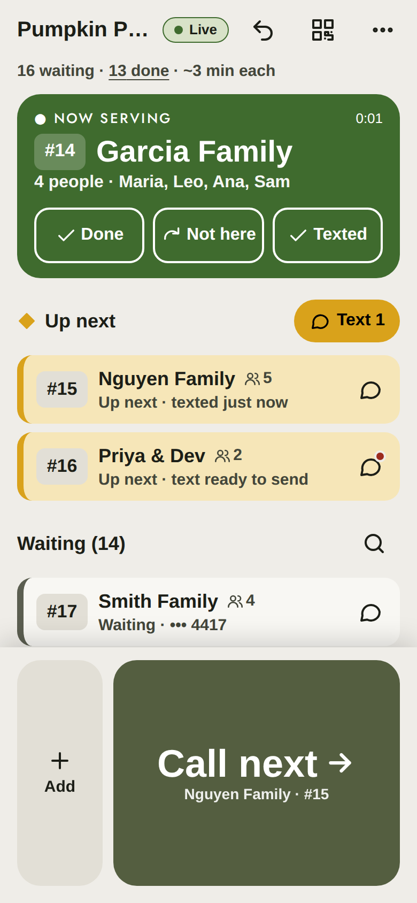
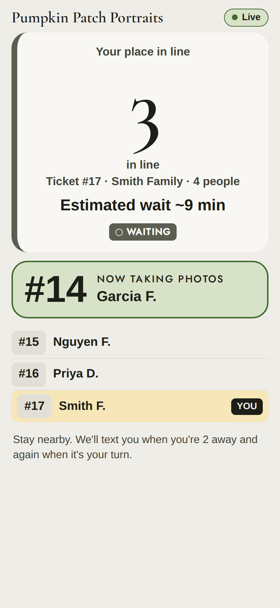

# PBY Queue

A photo-line queue for Photos by Yaz. The photographer (the "host") imports or adds families,
calls the next party with one thumb, and guests get texted when they are **Up next** and when
**it's their turn**. Every guest has a private live page showing their place in line, who is
being photographed now, and roughly how long they will wait.

| Host dashboard                                         | Guest status                                       | Guest: it's your turn                              |
| ------------------------------------------------------ | -------------------------------------------------- | -------------------------------------------------- |
|  |  |  |

More screenshots are in [`docs/screenshots/`](docs/screenshots). Product decisions, features and
design are in [`docs/`](docs); choices made where the specs were open are in
[`docs/IMPLEMENTATION_NOTES.md`](docs/IMPLEMENTATION_NOTES.md).

## What's in the MVP

- **Events**: create (needs `ADMIN_PASSWORD`), host PIN login, helper devices (up to 5, synced
  live), settings, end event, "Delete guest data now".
- **Adding people**: type it in, Excel/CSV import with a preview and a downloadable template,
  iPhone contact files (.vcf), the Android Contact Picker, and QR / link self-join. Duplicate
  phone numbers are flagged but allowed.
- **Arrival check-in**: imported parties start as "not here yet" and Call next skips them until
  the host (or the guest, from their status page) checks them in.
- **Queue**: ticket numbers, a big Call next button in the thumb zone, automatic Up next,
  Not here / skip with re-insert 3 spots back, Serve now, Move up / down / to next, Remove, and
  Undo. The screen stays awake and the phone buzzes on Call next.
- **Texting**: tap-to-send by default (the host's phone opens Messages with the text filled in,
  one tap per text), or automatic sending through Twilio. STOP / START are honoured.
- **Guests**: live status page (WebSocket with polling fallback) with privacy-filtered names
  ("Emma R."), "I'm here" check-in, and a full-screen "It's your turn".
- **Privacy**: guest data is purged 7 days after an event closes, phone numbers are masked in
  logs, SMS bodies are never stored.
- **Installable PWA**, light theme tuned for sunlight, dark and max-contrast modes.

## Architecture

```
shared/   Types and pure logic used by both sides: queue state machine, wait estimates,
          phone normalization, SMS templates, name privacy, vCard and Excel row parsing.
server/   Node 22 + Fastify + better-sqlite3 + @fastify/websocket. Serves the API, the
          WebSocket feed, the Twilio webhook and the built web app.
web/      React + Vite + TypeScript PWA. Device-specific code lives in web/src/platform/
          (SMS links, contacts, wake lock, haptics, files, share) so it can be swapped for
          Capacitor plugins later.
e2e/      Playwright smoke test of the whole flow.
```

Every mutation goes through the server, which applies a pure function from `shared`, stores the
result in SQLite and broadcasts a snapshot to host devices and a privacy-filtered snapshot to
each guest page.

## Local development

Requirements: Node 22 and npm 10.

```bash
npm install
cp .env.example .env            # optional; see Configuration
ADMIN_PASSWORD=dev npm run dev  # API on :3000, Vite on :5173 (proxied)
```

Open <http://localhost:5173/host>, tap **New event**, and use `dev` as the admin password. To
see a guest page, open a party's actions and tap **Status page**, or scan the QR code on the
share screen from a phone on the same network (use the computer's LAN address instead of
localhost).

| Command             | What it does                                                                                                                                            |
| ------------------- | ------------------------------------------------------------------------------------------------------------------------------------------------------- |
| `npm run dev`       | Server (tsx watch) and Vite dev server together                                                                                                         |
| `npm run build`     | Builds shared, server and web (`web/dist` is served by the server)                                                                                      |
| `npm start`         | Runs the production build on `PORT` (default 3000)                                                                                                      |
| `npm run lint`      | ESLint and Prettier check                                                                                                                               |
| `npm run typecheck` | TypeScript in every workspace                                                                                                                           |
| `npm test`          | Vitest unit and API tests (shared, server, web)                                                                                                         |
| `npm run e2e`       | Playwright smoke test against the production build (run `npm run build` first; CI installs Chromium with `npx playwright install --with-deps chromium`) |

## Configuration

All settings are environment variables; [`.env.example`](.env.example) lists them with comments.

| Variable                                                                                   | Default                                                | Notes                                                                                                                                                                                                        |
| ------------------------------------------------------------------------------------------ | ------------------------------------------------------ | ------------------------------------------------------------------------------------------------------------------------------------------------------------------------------------------------------------ |
| `ADMIN_PASSWORD`                                                                           | –                                                      | Required to create events.                                                                                                                                                                                   |
| `PUBLIC_URL`                                                                               | origin of the request that created the event           | Base for texted links and the QR code, e.g. `https://q.example.com`. Keep the host 25 characters or less so links fit in one SMS. Also used to validate Twilio webhook signatures.                           |
| `PORT` / `HOST`                                                                            | `3000` / `0.0.0.0`                                     |                                                                                                                                                                                                              |
| `DATABASE_PATH`                                                                            | `./data/pby-queue.db` (`/data/pby-queue.db` in Docker) | SQLite file.                                                                                                                                                                                                 |
| `TRUST_PROXY`                                                                              | `1`                                                    | Proxy hops to trust for `X-Forwarded-*` (`true` = 1). Use `2` behind two proxies, an IP/CIDR list, or `false` when the app is exposed directly (otherwise clients can forge their IP and dodge rate limits). |
| `COOKIE_SECURE`                                                                            | `auto`                                                 | `auto` marks the session cookie Secure on HTTPS requests.                                                                                                                                                    |
| `RETENTION_DAYS`                                                                           | `7`                                                    | Days after close before guest data is purged.                                                                                                                                                                |
| `AUTO_CLOSE_HOURS`                                                                         | `12`                                                   | Idle hours before an open event closes itself.                                                                                                                                                               |
| `TWILIO_ACCOUNT_SID`, `TWILIO_AUTH_TOKEN`, `TWILIO_FROM` or `TWILIO_MESSAGING_SERVICE_SID` | –                                                      | Enables the "Automatic" texting option.                                                                                                                                                                      |
| `OPTOUT_SALT`                                                                              | generated and stored in the database                   | Salt for opt-out hashes.                                                                                                                                                                                     |
| `LOG_LEVEL`                                                                                | `info`                                                 |                                                                                                                                                                                                              |

## Running with Docker

```bash
cp .env.example .env    # set ADMIN_PASSWORD and PUBLIC_URL
docker compose up -d --build
```

The image is a multi-stage build on `node:22-bookworm-slim`. It runs as the unprivileged `node`
user (uid 1000), listens on port 3000, keeps the SQLite database in the `/data` volume and has a
health check on `/healthz`.

## Running on Unraid

1. **Build the image** once from the Unraid terminal (or build it elsewhere and push it to a
   registry you control):

   ```bash
   cd /mnt/user/appdata && git clone <this repo> pby-queue-src && cd pby-queue-src
   docker build -t pby-queue:latest .
   mkdir -p /mnt/user/appdata/pby-queue && chown 1000:1000 /mnt/user/appdata/pby-queue
   ```

2. **Docker → Add Container** with these template fields:

   | Field                     | Value                                                                                                                      |
   | ------------------------- | -------------------------------------------------------------------------------------------------------------------------- |
   | Name                      | `pby-queue`                                                                                                                |
   | Repository                | `pby-queue:latest`                                                                                                         |
   | Network Type              | `bridge`                                                                                                                   |
   | WebUI                     | `http://[IP]:[PORT:3000]/host`                                                                                             |
   | Port (Container 3000)     | Host port `3000` (or any free port)                                                                                        |
   | Path (Container `/data`)  | `/mnt/user/appdata/pby-queue`                                                                                              |
   | Variable `ADMIN_PASSWORD` | a long password (mask it)                                                                                                  |
   | Variable `PUBLIC_URL`     | `https://q.yourdomain.com` (your tunnel hostname)                                                                          |
   | Variable `TZ`             | e.g. `America/Chicago` (log timestamps only)                                                                               |
   | Variables `TWILIO_*`      | optional, see Twilio below                                                                                                 |
   | Extra Parameters          | optional `--user 99:100` if you'd rather own the appdata folder as `nobody:users` (then `chown 99:100` the folder instead) |

3. **Cloudflare Tunnel** (no open ports on your router):
   - In Cloudflare Zero Trust → Networks → Tunnels, create a tunnel and copy its token.
   - Install the **cloudflared** container from Community Apps (or run
     `cloudflare/cloudflared:latest tunnel --no-autoupdate run --token <TOKEN>`).
   - Add a **Public hostname**: `q.yourdomain.com` → service `http://<UNRAID_IP>:3000`.
     WebSockets work through tunnels with no extra settings.
   - Set `PUBLIC_URL=https://q.yourdomain.com`. `TRUST_PROXY=1` (the default: trust one proxy
     hop, cloudflared) lets the app see HTTPS, so the session cookie is marked Secure, and see the
     real client IP for rate limits. Don't also publish port 3000 to the internet: a direct
     client could then forge `X-Forwarded-For`. If the app must be reachable directly, set
     `TRUST_PROXY=false`.
   - Don't put the site behind Cloudflare Access: guests must reach `/j/…` and `/s/…` without
     logging in. If you want Access for hosts, apply it to `/host*` only.

Backups: the whole state is `/mnt/user/appdata/pby-queue/pby-queue.db` (plus `-wal`). Only back
it up if you want to; backups keep guest data beyond the 7-day purge.

## Running on Fly.io

SQLite needs a single machine with a volume.

```bash
fly launch --no-deploy --name pby-queue      # uses the Dockerfile
fly volumes create pby_data --size 1 --region <region>
fly secrets set ADMIN_PASSWORD=... PUBLIC_URL=https://pby-queue.fly.dev
fly deploy
```

Add this to the generated `fly.toml`:

```toml
[mounts]
  source = "pby_data"
  destination = "/data"

[http_service]
  internal_port = 3000
  force_https = true
  auto_stop_machines = "off"     # keep WebSockets alive during an event
  min_machines_running = 1

[[http_service.checks]]
  path = "/healthz"
  interval = "30s"
  timeout = "5s"
```

Keep the app at one machine (`fly scale count 1`); the rate limits and WebSocket hub live in
memory.

## Running on Render

1. New → **Web Service** → connect the repo; Render detects the Dockerfile.
2. Add a **Disk** (paid instance types) mounted at `/data`, 1 GB is plenty.
3. Environment: `ADMIN_PASSWORD`, `PUBLIC_URL=https://<service>.onrender.com` (or your custom
   domain), and optionally the `TWILIO_*` variables.
4. Health check path: `/healthz`. Keep one instance.

Free instances sleep and have no disk, so they are not suitable for a live event.

## Twilio setup (optional)

Tap-to-send needs no setup: texts go from the host's own phone. For automatic texts:

1. **Get a number and register it. Start early: registration takes days to weeks.**
   - **Toll-free number (recommended)**: Console → Phone Numbers → Buy a toll-free number, then
     Console → Messaging → Regulatory Compliance → **Toll-Free Verification**. Describe the use
     case ("photo line notifications for events"), the opt-in ("guests tick an unchecked box
     when joining by QR code; for imported rosters the photographer confirms the families agreed
     to texts"), and paste the four message templates below as samples. Unverified toll-free
     numbers are blocked from sending to US phones.
   - **Local 10-digit number**: register an **A2P 10DLC** brand and campaign instead.
2. Optional: create a **Messaging Service**, add the number, and set a **HELP** reply with your
   business name and contact. Advanced Opt-Out (on by default) replies to STOP / START itself,
   so the app never sends its own confirmation.
3. **Inbound webhook** for STOP / START: on the number (or the Messaging Service → Integration),
   set "A message comes in" to **Webhook, HTTP POST**
   `https://q.yourdomain.com/sms/twilio/inbound`. The URL must start with exactly your
   `PUBLIC_URL`, because the app validates `X-Twilio-Signature` against it.
4. Set `TWILIO_ACCOUNT_SID`, `TWILIO_AUTH_TOKEN` and either `TWILIO_FROM` (E.164, e.g.
   `+18885551234`) or `TWILIO_MESSAGING_SERVICE_SID`, then restart. "Automatic" now appears
   under Texting in event creation and Settings.

How texting works in Twilio mode:

- The first text to a number in an event ends with ` Reply STOP to opt out.`
- Opted-out numbers are stored only as salted SHA-256 hashes, are kept across events and survive
  the data purge, and are checked before every send (tap-to-send honours them too).
- Twilio error 21610 (unsubscribed recipient) marks the number opted out, shown with ⚠.
- Only US numbers are texted through Twilio; international numbers work in tap-to-send only.

Default messages (GSM-7, at most 160 characters):

| When                                     | Text                                                                                       |
| ---------------------------------------- | ------------------------------------------------------------------------------------------ |
| Joined / imported (optional for imports) | `{event}: {name}, you're #{pos} in line (~{wait} min). Track live: {link}`                 |
| Up next                                  | `{event}: {name}, you're up next! Please head to the photo area now. Status: {link}`       |
| Your turn                                | `{event}: {name}, it's your turn! Please come to the camera now.`                          |
| Missed                                   | `{event}: {name}, we called you but missed you. Find the host to get back in line: {link}` |

## Excel / CSV template

In **Add → Spreadsheet**, tap **Download template** (`.xlsx`, or **CSV**). One party per row,
headers in row 1 of a sheet named `Queue` (otherwise the first sheet is used). Headers are
case-insensitive and extra columns are ignored.

| Column       | Required | Format                                                     | Also accepted                    |
| ------------ | -------- | ---------------------------------------------------------- | -------------------------------- |
| `Name`       | Yes      | Party display name, e.g. "Rivera Family" (1–40 characters) | `Party Name`, `Full Name`        |
| `Phone`      | No       | Any US format. Blank means no texts; shown as a warning    | `Mobile`, `Cell`, `Phone Number` |
| `Party Size` | No       | Whole number 1–20. Blank = number of members, or 1         | `Size`, `Count`                  |
| `Members`    | No       | Names separated by `;` or `,` (up to 20)                   | `Member Names`                   |
| `Group`      | No       | Free text such as "U10 Hawks" (stored for a later release) | `Team`, `Class`                  |
| `Notes`      | No       | Host-only, up to 200 characters                            |                                  |

Rules: row order becomes queue order; rows without a Name are skipped, and so are rows whose
Name starts with `Example` (the template's two sample rows); at most 500 rows per import and 500
active parties per event; CSV files must be UTF-8 (a BOM is fine). The preview lists problems
first: invalid phone numbers can be fixed inline or kept (that party gets no texts), rows with
errors must be fixed or left out, and phones already in line are flagged as possible duplicates.
Imported parties start as **not here yet**; tick "Everyone is here already" to check them all
in. Join texts are off by default for imports.

**iPhone contacts**: in Contacts, select people → Share → Save to Files, then choose the `.vcf`
in **Add → Contact file**. Each contact becomes a party of one (mobile number preferred), editable
in the preview.

## Data retention

- Events close automatically 12 hours after the last host action, or when the host ends them.
  Closing stops self-join and guest updates and signs out every device (the host can sign back in
  with the PIN to delete data).
- Names, phone numbers, members, notes, status links and the SMS log are deleted 7 days after
  close (or immediately with **Delete guest data now**). Counts and average service time are kept.
- The purge runs at startup and every 24 hours, with `VACUUM` weekly.
